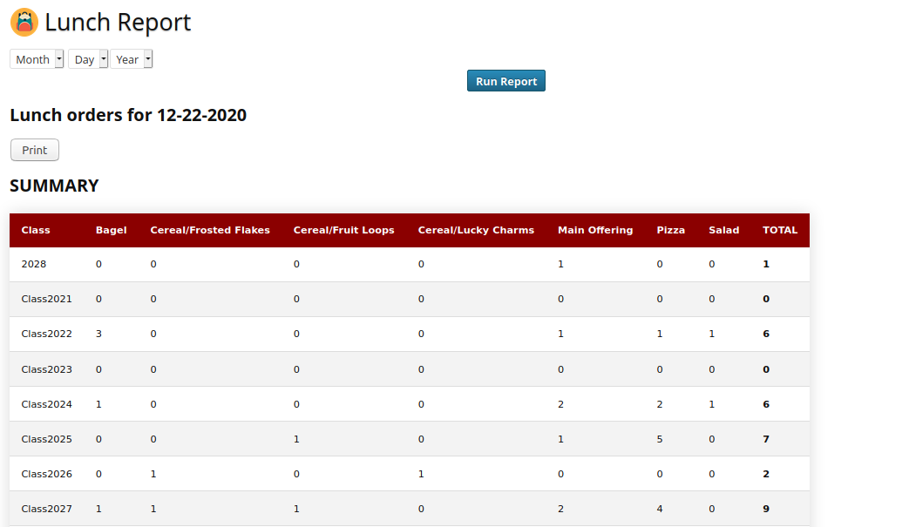
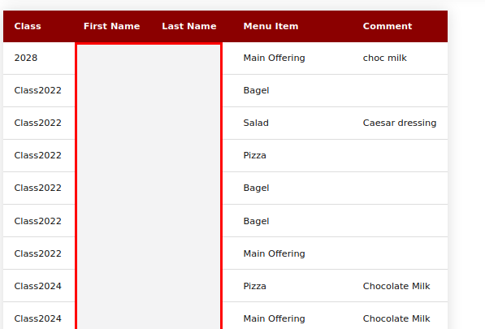
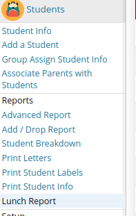
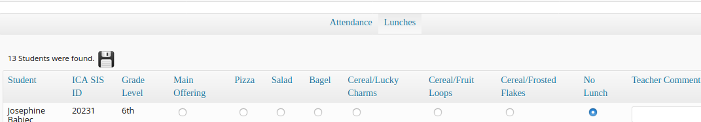

Lunch Reports Plugin
====================

Version 1.0 - January, 2021

License GNU GPL v2

Author Doc Stem (aka Gregory J. Forkin)

DESCRIPTION
-----------
Generate Lunch Order Reports for your School.
We utilize the Attendance function to also take Lunch Orders. This Plugin will report on the lunches ordered for the cafeteria.

Includes Help.
Translations not completed

CONTENT
---------
Student
	Reports
	- Lunch Reports
It will appear in Student Reports

	

IMPORTANT SETUP INFORMATION
---------------------------
This module assumes that you use the FOOD ORDER same as with Attendance and that you are not running a full blow Food system. It takes simple Menu Orders when you take the Attendance. Set up the Food Order per the Rosario SIS instructions. We wrote this during COVID, so we needed to be able to take the food to the children since they cannot come to a Cafeteria.
We take Food orders this way 

Also YOU MUST create a Student Custom Field of CLASS. We use this to track the graduation year of every student. This information is invaluable to many things we do. Example Class2025

This module installs 2 Views into the Data base. 
1- Active Students
2- student_lunches

(IF you do not want to use the CLASS custom field the way we do, change the student_lunches view and change the CLASS to something you would use. example Grade As Class)

INSTALL
-------
Copy the `LunchReport/` folder (if named `LunchReport-master`, rename it) and its content inside the `modules/` folder of RosarioSIS.

Go to _School > Configuration > Modules_ and click "Activate".

Requires RosarioSIS 5.5+

Update
-------
Update Sept. 2021 -- added the condition of school year to the query condition to stop repeats that happened with students from previous year. The condition is that syear = UserSYear
